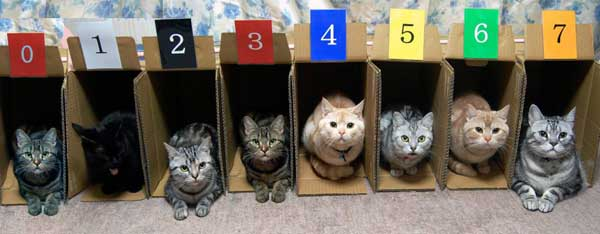

# Масиви

Якщо порівнювати змінну із коробочкою, то масив це ціла полиця з такими коробочками. _Масив_ — це складений тип даних, сукупність, що складається у Java з однотипних елементів, кожен з яких має свій _індекс_. Погляньте на приклад "масиву" у реальному житті:



Це масив із 7 елементів, кожен з яких одного типу (кіт) і має індекс. **Важливо**: у Java рахувати починають з _нуля_! Нехай замість котів будуть листи (текст), а замість коробок — ящики у поштовому відділенні. Нам не потрібно знати зміст листа, щоб його знайти — достатньо знати номер ящика, у якому він лежить. Що ж, зазирнемо у Java.

Створити масив можна або порожнім, або вже заповненим. По-перше, масиви мають тип їх елементів, але ще з квадратними дужками; тоді масив цілих чисел матиме тип `int[]`, а масив рядків — `String[]`. По-друге, порожні масиви створюються за допомогою слова `new`, а заповнені можна створити, вказавши його елементи через кому у фігурних дужках. Загальна схема та приклади створення масивів:

```java
//Порожні масиви
тип[] назва = new тип[розмір];
int[] a = new int[5]; //Цілочисельний масив з п'ятьма елементами

//Заповнені масиви
тип[] назва = {елементи через кому};
String[] b = {"Lorem", "ipsum", "dolor"};
```
Для кращого розуміння погляньте на таблицю, що відображає масив `b`:

| Індекс | Елемент |
|:-------|:--------|
| 0      | "Lorem" |
| 1      | "ipsum" |
| 2      | "dolor" |

Отримати один елемент з масиву можна таким же чином, як і значення змінної, але потрібно вказати у квадратних дужках індекс цього елемента:

```java
масив[індекс]
System.out.println( b[2] ); //dolor
System.out.println( b[0] ); //Lorem
```
Якщо вказати індекс, який не існує: такого елемента немає у масиві, — буде помилка `ArrayIndexOutOfBoundsException`. Також можна змінити елемент (або задати його, якщо він був "порожнім") звичайним присвоєнням:

```java
масив[індекс] = значення;
b[1] = "sit amet";
```

## Інструкція foreach

Існує ще один різновид циклу `for`, про який, я вважаю, не можна було розповідати до того, як Ви вивчили масиви, і це — foreach, або як його ще називають — "покращений for". Цей цикл дозволяє зручніше пройтись по кожному значенню масива. Загальна схема:

```java
for (тип назва_елементу : масив) інструкція;
```
Для прикладу, є масив `String[] things = {"котів", "Java", "книжки"};`, до кожного слова якого треба додати "Я люблю". Виглядатиме це так:

```java
for (String s : things) {
	System.out.println("Я люблю " + s);
}
```
> Я люблю котів

> Я люблю Java

> Я люблю книжки

## Довжина контейнерів

_Контейнером_ широко можна назвати будь-яке значення, що складається (містить у собі) з менших одиниць. Масиви є базовим прикладом контейнерів, а тексти (String) це також контейнери із символів. У них є функція `toCharArray()`, яка дозволяє перетворити String в сhar[], наприклад для того ж циклу foreach.

Однак, ще однією дуже корисною навичкою є отримання "довжини" масивів, тобто кількості їхніх елементів. Для цього слід використати _поле_ (Ви дізнаєтесь що це пізніше) `length`. У рядків є відповідна функція `length()`:

```java
масив.length
текст.length()
```

## Багатовимірні масиви

_Двовимірний масив_ можна представити як таблицю — це масив масивів. Працювати з ним не складніше ніж з одновимірними — лише потрібні ще одні квадратні дужки:

```java
int[][] table = { {2,   4,   8  },
                  {16,  32,  64 },
                  {128, 256, 512} };
table[0][2] = 6; //Число на рядку 0 (першому) у стовпці 2 (третьому) змінили з 8 на 6
System.out.println(table[2][1]); //Виведе число 256
```
Можна створювати три-, п'яти-, та навіть стовимірні масиви так само, однак з ними працювати дуже незручно, тому замість них використовують інші більш складні структури (об'єкти), про які Ви дізнаєтесь через одну тему.
