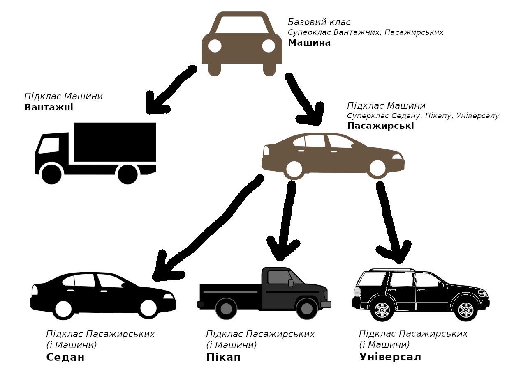
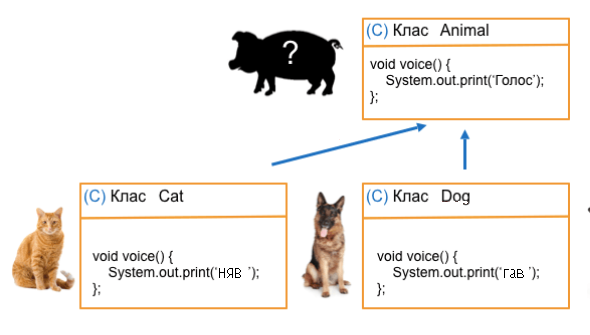

# Об'єктно-орієнтоване програмування

Огляніться: навколо себе Ви бачите багато речей — все це _об'єкти_, і більшість, якщо не всі, можна віднести до якогось типу — _класу_. Погляньте на схему нижче. "Машина" — це клас, а "BMW" або "Mercedes-Benz" — це об'єкти цього класу. Кожна машина має свої _властивості_ — змінні об'єктів — та _методи_ — функції об'єктів. Така система є першим із "чотирьох китів", що включає в своє поняття _Об'єктно-орієнтоване програмування (ООП)_ — _інкапсуляція_.


Нехай є _базовий клас_ "машина", який поділяється на _підкласи_ "вантажний" та "пасажирський", який у свою чергу є _батьківським класом (суперкласом)_ для _дочірніх класів (підкласів)_ "седан", "пікап", "універсал". Клас "машина" має _властивість_ "швидкість", клас "пасажирський" також має властивість "кількість місць", але так як він є підкласом "машини", тобто _наслідує_ її, то також має "швидкість". _Успадкування_ є другим компонентом ООП.



Залишмо автомобілі й візьмімо для прикладу тварин: є клас "Тварина" з методом "голос". Різні тварини роблять відмінні один від одного звуки, тому викликавши метод "голос", ми побачимо "Тварина видає звук". "Кіт" та "Собака" успадковують клас "Тварина" (адже є підкласами) та мають свої _реалізації (імплементації)_ цього методу. Якщо є декілька різних тварин (для прикладу, у масиві), то викликавши метод "голос" для кожної, результати будуть різні: як "гав", так і "няв". Виходить, що не потрібно знати яка саме ця тварина для того, щоб почути відповідний звук: кожен підклас "Тварини" має свій "голос", _заміщуючи_ цей метод. Третім принципом ООП є _поліморфізм_, що означає здатність мати багато форм.



Напевно, у Вас є смартфон або комп'ютер, якщо Ви це можете читати. На ньому є кнопки регулювання звуку. Вам достатньо використати їх, і гучність зміниться; так не потрібно знати, як вони працюють всередині в деталях. Так само у Java деякі методи або властивості класу можуть бути невидимими поза ним, у цьому суть четвертої складової ООП — _абстракції_.

### Пакети

У Java кожен клас (навіть Main) вірогідніше знаходиться у певному _пакеті_. Всі змінні, класи, об'єкти мають свою назву (наприклад `tree12` чи `kilkist_vygotovlenyh_verstativ`) — ці назви називаються _ідентифікаторами (іменами)_. У сучасних мовах програмування їх об'єднують у _простори імен_. Нехай Максим працює в компанії А, і він має номер працівника 10, а Софія працює в компанії Б, хоча також має номер працівника 10. У обох працівників однакова змінна `номер працівника` з однаковим значенням `10`, але її можна розрізнити, адже вони працюють у різних компаніях, тобто просторах імен. Саме у Java цю ідею втілюють пакети, які на практиці є папками, а у коді визначаються на початку файла (як у файлі Main.java) словом `package` та шляхом до пакету, але через крапку:

```java
package com.moyacompaniya.moyipratsivnyky;
```

### Область видимості

Можливо, Ви помітили, що якщо створити змінну у блоці, то поза ним використовувати її не можна. Це ж правило стосується й кожної функції і навіть класів. Кожна така ділянка програми з обмеженням на доступ по імен має свою _область видимості_. Можна використовувати змінні з ширшої області видимості (наприклад, у циклі змінна, створена у функції), але не навпаки. До речі, класи (зокрема в пакетах) також мають свої області видимості.


В ООП є поділ областей видимості на _відкриті_, _закриті_ й _захищені_. Ці області видимості полів, методів і класів визначають словами `public`, `private` та `protected` відповідно, а самі слова називають _модифікаторами доступу_. Нижче наведена таблиця порівняння доступу до даних, залежно від цих модифікаторів:

| Модифікатор        | Всередині класу    | У пакеті класу     | В підкласі класу   | Всюди              |
|:-------------------|:-------------------|:-------------------|:-------------------|:-------------------|
| public             | :heavy_check_mark: | :heavy_check_mark: | :heavy_check_mark: | :heavy_check_mark: |
| protected          | :heavy_check_mark: | :heavy_check_mark: | :heavy_check_mark: | :x:                |
| (без модифікатора) | :heavy_check_mark: | :heavy_check_mark: | :x:                | :x:                |
| private            | :heavy_check_mark: | :x:                | :x:                | :x:                |

## Інкапсуляція

#### Класи

Дослівно "внесення у капсулу", означає занесення деяких даних та функцій в обмежений простір, огортання у _клас_. Сама змінна "номер" не має сенсу, який номер? Тим часом, змінна "номер" у класі "Телефон" одразу зрозуміла. За звичаєм, _класи бувають відкритими (публічними) або без модифікатора_. Причому, кожен публічний клас має бути в окремому файлі. Як видно із першого класу Main, для створення достатньо використати слово `class`. Приклади:

```java
public class Car {
	//Тіло класу
}
class Engine {
	//Тіло класу
}
```
Класи містять або дані (поля), або функції (методи). Вони можуть мати такі (насправді їх більше) модифікатори: видимості — `public`, `protected`, `private`, та тип — `static`. Створімо свій клас "Машина" з полями "швидкість", "ціна", "модель" і "виробник", та методом "їхати". Уявімо, що швидкість машини можна дізнатись лише вимірявши її, а напряму отримати не можна — швидкість буде "приватною" — для цього створимо ще один метод "виміряти швидкість":

```java
class Car {
	private int speed;
	public int price;
	String model, manufacture;
	void move() {
		System.out.println("Машина їде");
	}
	int getSpeed() {
		return this.speed;
	}
}
```
По-перше, скажу, що звичайно можна було зробити ціну і швидкість без модифікаторів, а методи відкритими; це зараз не принципово, тому на розсуд автора коду. По-друге, щоб не повторювати тип для декількох змінних, у Java можна писати їх через _кому_: `int a, b, c;` це те ж саме, що й `int a; int b; int c;`. По-третє, тут з'являється нове слово — `this`. Можна було б писати без нього, однак я дуже рекомендую використовувати `this`. Це слово існує для звернення до полів і методів класу в його межах. Це важливо, адже може бути змінна всередині методу з однаковою назвою, і тільки так їх можна розрізнити:

```java
class A {
	int x = 20;
	void f(){
		int x = 5;
		System.out.println( x      ); //5
		System.out.println( this.x ); //20;
	}
}
```

#### Об'єкти

У "шляху" до даних в Java використовують _крапки_, тому ми пишемо this`.`x. Що ж, у нас є клас Автомобіль, тому тепер маємо можливість створити _об'єкт_ — окремий екземпляр, сутність класу. Якщо Ви пам'ятаєте, для введення ми вже використовували об'єкт класу `Scanner`. Створюються об'єкти як звичайні змінні (`тип назва;`), а от задаються словом `new`, назвою об'єкта і дужками:

```java
Car car1;
Car car2 = new Car();
```
Якщо поле (або метод) не приватне, то можна його змінити або зчитати (або викликати) _для даного об'єкта_. Для цього використовуємо крапку:

```java
car2.model = "Camaro SS";
car2.move();
```

#### Конструктори

Навіщо при створенні об'єкту потрібні дужки, якщо це не функція? Дивно, але кожен клас має хоч один _конструктор_ — особливий метод, який викликається при створенні об'єкта, навіть якщо ми його ніде не писали. Конструкторів може бути багато, кожен з різними аргументами, як перевантажені функції. Щоб створити конструктор, достатньо написати метод з такою ж назвою, як і клас. _Конструктори не мають повернення й найчастіше є відкритими._ Ось відразу декілька конструкторів для "Машини":

```java
class Car {
	... //Тут поля, функції, створені раніше
	public Car(){
		System.out.println("Ви створили нову машину.");
	}
	public Car(String manuf, String model){
		this.manufacture = manuf;
		this.model = model;
		System.out.println("Ви створили новий " + manuf +" "+ model);
	}
}
```
Тепер можна створювати машини, встановлюючи бренд і модель відразу, або не встановлювати, як раніше:

```java
Car c1 = new Car();
Car c2 = new Car("Ford", "Mustang GT");
```
Також є метод для виклику іншого конструктора класу — `this()`. Таким чином можна "доповнювати" дані об'єкта або встановлювати їх за замочуванням (це можна робити просто присвоєнням до полів, обидва варіанти нижче):

```java
class A {
	String name;
	public A(String name) {
		this.name = name;
	}
	public A() {
		this("Julia");
	}
}
class B {
	String name = "Julia";
}
```

#### Статичність

Як відомо, у кожного об'єкта можуть бути свої значення полів, однак інколи зручно (наприклад, для статистичних даних), коли значення одне для всього класу. Такі поля і методи є _статичними_ — вони належать не об'єктам, а класам. Візьмімо наш клас Автомобіля й додамо до нього статичне поле `count` (кількість), а в конструкторі будемо додавати до нього 1. Отримаємо, що при створенні кожної машини кількість автомобілів збільшуватиметься і у будь-який момент можна буде дізнатись загальну кількість машин. _Увага:_ статичні дані належать класу, тому доступ до них лише через сам клас, а не через об'єкт!

```java
class Car {
	static int count = 0;
	public Car(){
		count++;
	}
}
```
```java
System.out.println( Car.count ); //0
Car c1 = new Car();
Car c2 = new Car();
System.out.println( Car.count ); //2
```

### Далі

Тема ООП є досить великою, тому я вимушен розділити її на дві частини. Тут Ви розглянули основу ООП — інкапсуляцію, а у другій частині буде успадкування, абстракція і поліморфізм, а також Ви дізнаєтесь про константи. Попрактикуйтесь та спробуйте зрозуміти усі попередні теми перед тим, як починати наступну.

