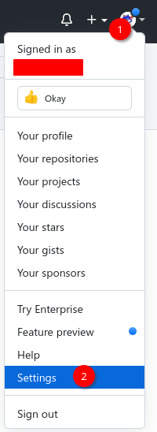
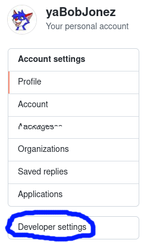
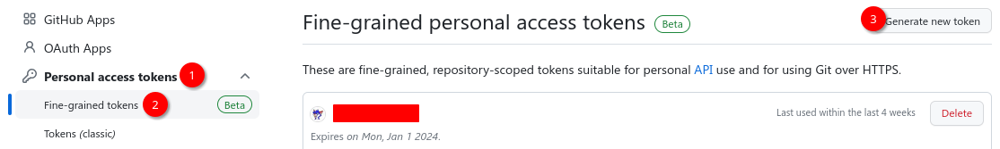
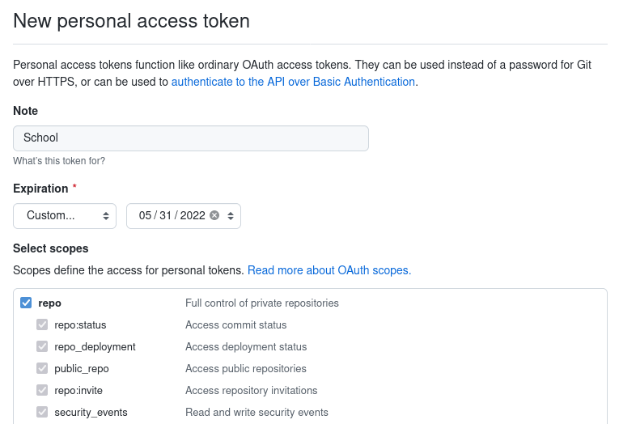
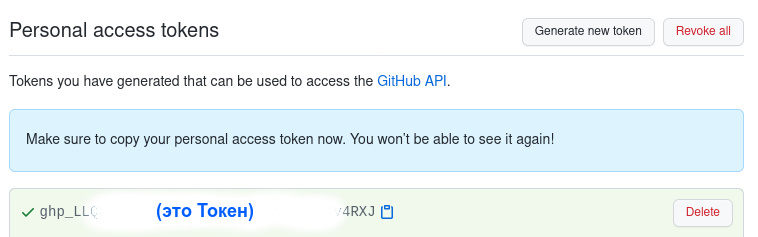

# Авторизация в GitHub через Git после Лета 2021

Начиная с 13 Августа 2021, GitHub больше не принимает пароли от аккаунтов для аутентификации и проведения операций с GitHub через Git, поэтому для взаимодействия с удалённым репозиторием важно уметь создать Токены (новый способ аутентификации) и использовать их.

### Создание Public Access Token (PAT)

Войдя на сайт [GitHub'а](https://github.com/), в правом верхнем углу нажмите на иконку профиля, далее выберете Настройки:

В Настройках необходимо выбрать вкладку Настроек Разработчика:

В соответствующей вкладке Персональных Токенов Доступа нажмите "Сгенерировать новый токен":

Здесь стоит настроить токен под себя, а значит:

- Выбрать название (Заметку, или Note)
- Срок действия или дату истечения, после которого он будет удалён
- Разрешения — доступ к каким функциям и данным можно получить через токен

Для обычных школьных действий с GitHub, ожидается, что будет достаточно выбрать лишь полный доступ (кроме удаления) к репозиториям — `repo`.
_Внимание:_ выбирать доступ ко всему не рекомендуется в целях безопасности аккаунта.

Когда с настройкой закончено, нажмите в конце страницы кнопку для создания самого токена.

Созданный токен будет отображён на странице, можно его скопировать и сохранить или сфотографировать.

**Это важно,** _ведь посмотреть токен ещё раз будет **невозможно**. Храните токен в безопасном месте и никому не давайте, ведь он работает как пароль._

В любое время, при потребности токен можно удалить вручную в той же вкладке, нажав на кнопку удаления ("Delete").

