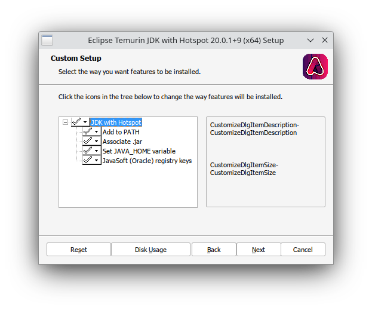
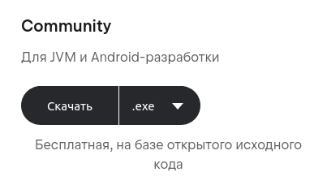
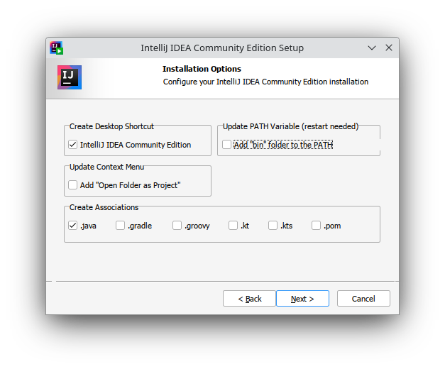

# Що таке Java? JDK, JRE, JVM? .class та .jar?

Порівняймо Java із людською, наприклад українською, мовою, щоб зрозуміти. Будь-яка мова це простими словами лише набір слів та правил їхнього поєднання для комунікації. Java це одна із сучасних мов, які дозволяють "спілкуватись", тобто давати команди, комп'ютеру. Як і українська мова, Java — це абстрактне поняття; коли ми спілкуємося українською, ми маємо на увазі, що передаємо свої думки за допомогою цих правил та слів. Однак ми можемо використовувати різні для цього засоби: жести, звуки, написані символи, зображення тощо. Кожен із таких засобів щодо мов програмування називається певною реалізацією, або імплементацією.

Творцем Java була компанія Sun, але імплементацій мови існує безліч, серед яких є як платні, так і безкоштовні. Найвідомішою безкоштовною та досить зручною є OpenJDK, яку ми й будемо встановлювати далі. Вона включає у себе повний набір інструментів для розробки програм на Java, який називається Java Development Kit (JDK), та мінімальний набір лише для запуску таких програм — Java Runtime Environment (JRE). Є різні способи встановити OpenJDK із різних джерел, тому далі є коротка інструкція до одного із них.

Як власне пов'язані між собою всі ці інструменти та як взагалі вони працюють разом? Коли Ви пишете код, _компілятор Java_ (особлива програма для переведення коду) перетворює цей код у _байт-код_, тобто мінімальну однорівневу послідовність інструкцій (у форматі _.class_), який потім здатна виконувати _Java Virtual Machine (JVM)_ — віртуальна машина Java, яка встановлена у користувача на комп'ютері. Компілятор здатний "пакувати" байт-код у один (або декілька) файлів у форматі _.jar_, які є майже звичайними архівами для зручного перенесення та використання Вашої програми.

## Встановлення Java Development Kit

Для компіляції та виконання написаного коду знадобится JDE. Установімо його!

### Windows

Щоб встановити JDK через Adoptium, зайдіть на [сайт](https://adoptium.net/), та натисніть велику кнопку, яку зображено нижче, або виберіть іншу версію за допомогою "Other platforms and versions".

Після завантаження .msi, запустіть цей інсталятор та слідуйте інструкціям. Обов'язково виберіть всі компоненти, як показано нижче.

Можливо знадобится перезавантаження для застосування змін до системних змінних.

### Linux

Використовуйте пакетний менеджер свого дистрибутиву (apt, rpm, pacman тощо).

Назва пакету JDK 20 в деяких ОС:
- Debian, Ubuntu, Linux Mint `openjdk-21-jdk` / `default-jdk`
- Fedora, CentOS, RHEL, OpenSUSE `java-latest-openjdk-devel` / `java-17-openjdk-devel`
- Arch Linux, Manjaro `jdk-openjdk`

### macOS

**?** _Якщо Ви використовували macOS та знаєте, як встановити JDK на неї, будь ласка, додайте сюди._

## Встановлення середовища розробки

Однак, перед тим, як виконати код, його потрібно десь написати. Звичайний "Блокнот" чи щось таке — недостатньо, адже вручну використовувати компілятор досить складно і незручно. Таким чином, існують _IDE_ — _integrated development environments_ — інтегровані середовища розробки. Наскільки я пам'ятаю, у школі використовували IntelliJ IDEA, тому далі буде інструкція із встановлення цієї IDE, хоча існують й альтернативи: Eclipse IDE, Netbeans та інші.

### Windows

Перейдіть на сайт JetBrains IntelliJ, на [сторінку завантаження](https://www.jetbrains.com/idea/download/?section=windows). Виберіть та завантажте безкоштовку версію — Community Edition:

Далі запустіть інсталятор та слідуйте інструкціям, але обов'язково впевнітся, що Ви вибрали хоча б такі опції:

Не забудьте перезавантажити Windows, коли встановлення завершиться.

### Linux

Якщо у Вашому дистрибутиві є Flatpak, встановіть [IntelliJ IDEA Community](https://flathub.org/apps/com.jetbrains.IntelliJ-IDEA-Community) через магазин додатків або вручну: `flatpak install flathub com.jetbrains.IntelliJ-IDEA-Community`.

Інакше можете скористатись [JetBrains Toolbox](https://www.jetbrains.com/toolbox-app/), який треба завантажити, розпакувати кудись, та запустити; слідувати інструкціям.

Іншим варіантом є встановлення [IDE окремо](https://www.jetbrains.com/idea/download/?section=linux) (аналогічно до Toolbox).

### macOS

**?** _Якщо Ви використовували macOS та знаєте, як встановити IntelliJ IDEA на неї, будь ласка, додайте сюди._

## Налаштування

Для JDK зазвичай налаштування не потрібне, а IntelliJ сама допоможе Вам налаштувати її під себе при першому запуску. Далі створімо проєкт:

1. При відкритті IDE натисніть "Створити новий проєкт"
2. Виберіть "Java", в "SDK" виберіть Ваш JDK, "Далі"
3. "Створити проєкт із шаблону" → "Консольна програма", "Далі"
4. Виберіть папку для проєкту (спочатку), і якщо потрібно, відкорегуйте назву
5. Готово, відкриється проєкт із класом Main!

