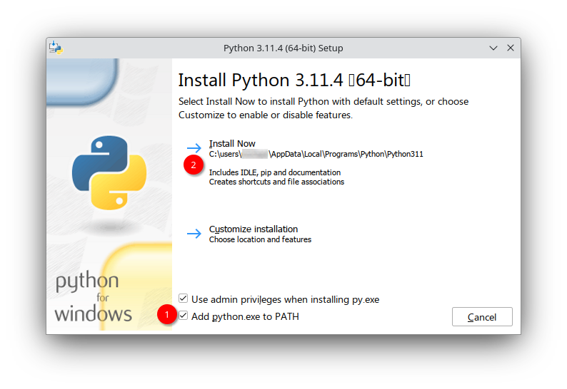
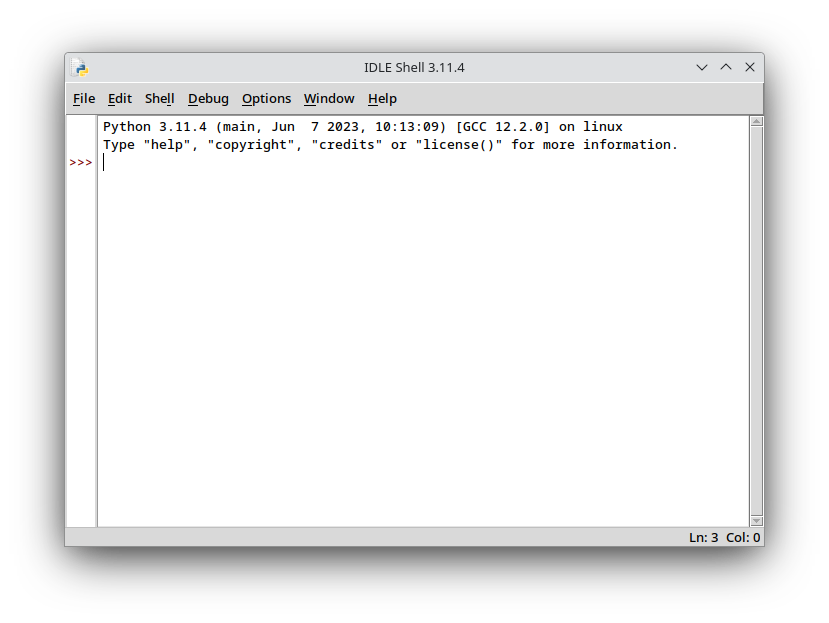

# Що таке Python? IDLE?

Даний курс є немовби продовженням вивчення мов програмування на інформатиці та спирається у багато чому на [Java](../CS/index), тому перед тим, як почати вивчати Python, рекомендую хоча б оглядово бути ознайомленим з тією мовою.

_Python_ (вимовляється як "пайтон") — це високорівнева інтерпретована об'єктно-орієнтована строго та динамічно типізована мова програмування загального призначення. Що це значить?

- _Інтерпретована_ означає, що код, написаний на Python виконується одразу рядок за рядком, а не переводиться у байт-код чи машинний код, на відміну від компільованих мов.
- _Строго типізована_ вказує, що за неоднозначних дій будуть помилки: мова не буде намагатись їх виправити або переводити автоматично в інші типи. Детальніше згодом.
- _Динамічна типізація_ — це коли змінні можуть відносно вільно змінювати свій тип.
- _Загального призначення_, як і Java, хоча це не згадувалось раніше, значить, що мова має широкий спектр застосувань.

Python був створений Гвідо ван Россумом у 1990 році (перша версія вийшла у 1991) та набув значної популярності через простоту коду та його експресивність. Слід зазначити, що Пайтон підтримує декілька _парадигм_ — стилей написання програм, — таких, як: об'єктно-орієнтована, _функціональна_ та _імперативна_.

- _Функціональна парадигма_ полягає у використанні підпрограм (процедур та функцій) для написання основного функціоналу.
- _Імперативними_ є більшість мов програмування. Це коли програміст дає вказівки комп'ютеру для послідовного виконання. Протиставленням є _декларативні_ мови, які описують бажаний результат.

Ця мова має досить велику стандартну бібліотеку, _пакетний менеджер_ "pip", а також просте вбудоване інтегроване середовище розробки під назвою _IDLE_. Додатково, Ви можете ознайомитися з _філософією_ Python — принципами дизайну мови, якими керувався ван Россум: [«Дзен Пайтона»](https://uk.wikipedia.org/wiki/Python#%D0%A4%D1%96%D0%BB%D0%BE%D1%81%D0%BE%D1%84%D1%96%D1%8F).

## Як Пайтон працює?

Код на мові Python пишуть у файлах з розширенням _.py_, і такі файли вважаються _модулями_ — дещо схожою на пакети у Java концепцією. _Інтерпретатор_, який фактично включає у себе компіляцію у .pyc файли та виконання їх на Python Virtual Machine (PVM) — віртуальній машині Пайтона, власне виконує весь код.


Пакетний менеджер — особливе, зазвичай системне, програмне забезпечення для встановлення деяких компонентів та програм (пакетів). Pip ("піп") дозволяє встановлювати бібліотеки для Python однією командою, таким чином вилучає необхідність вручну завантажувати та встановлювати їх.

IDLE — вбудована у Пайтон IDE, що працює зокрема в _інтерактивному режимі_ (REPL). Це дозволяє вводити по одній команді та одразу її виконувати, що зручно для тестування невеликих фрагментів коду.

## Встановлення Python

Для програмування на цій мові нам знадобиться стандартна реалізація та IDLE. Установімо її!

### Windows

Перейдіть на [офіційний сайт Python](https://www.python.org/downloads/windows/) та оберіть або останній (Latest Python 3 Release...), або будь-який стабільний (Stable Releases) випуск мови. Прогорніть сторінку з релізом до розділу "Files", та завантажте Windows installer для вашої розрядності (ймовірніше, 64 біти).



Обравши дані опції, Python автоматично встановиться разом з pip та IDLE. Можливо знадобится перезавантаження для застосування змін до системних змінних.

Альтернативно Ви можете скористатися Microsoft Store — магазином додатків для Windows, та встановити Python звідти.

### Linux

Використовуйте пакетний менеджер свого дистрибутиву (apt, rpm, pacman тощо).
Сам Python 3 на більшості дистрибутивів вже встановлений за замовчуванням, тому нижче відображені назви пакетів з IDLE.

Назва пакету в деяких ОС:
- Debian, Linux Mint `idle`
- Ubuntu `idle3`
- Fedora, CentOS, RHEL `python3-tools`
- OpenSUSE `python3-idle`
- Arch Linux, Manjaro `python` (має бути включеним в Python)

### macOS

**?** _Якщо Ви використовували macOS та знаєте, як встановити Python на неї, будь ласка, додайте сюди._

## Відмінності від Java

Їх дуже багато, адже це зовсім інша мова, однак тут я намагатимусь навести короткий огляд найбільш суттєвих з них.

### Відступи замість дужок

Як Ви вже знаєте, у багатьох мовах (Java, C++, C#, PHP, JavaScript тощо) для відокремлення блоків коду використовують фігурні дужки. Дизайнер Python пішов іншим шляхом: "блоки" як синтаксичні конструкції відсутні, а для відокремлення коду використовують відступи — "таби" або пропуски.

```python
def parity(number):
    result = "odd"
    if number % 2 == 0:
        result = "even"
    return result
```
У даному випадку можна здогадатись, як працює цей код, але зараз важливо побачити, що кожен вкладений фрагмент знаходиться на певній відстані від краю.

### Відсутність крапок з комами

Насправдні крапки з комами у Python також існують, однак принято їх уникати. Зазвичай кожну інструкцію пишуть з нового рядка. За конвенцією, через "важливість читабельності" коду, крапки з комами вважаються "не-пайтоновськими".

### Будь-що — об'єкт

У Java ми вважали об'єкти лише одним із типів даних. Інші типи включали примітивні, такі як int, double, char тощо, та масиви. У Python примітивні типи за дизайном відсутні, тому навіть числа є класами. Це робить Пайтон навіть більше об'єктно-орієнтованою мовою та дозволяє мати розширений функціонал для таких типів.

## Робота з IDLE

Звичайно, існують й інші середовища розробки, як-от JetBrains PyCharm, однак для простоти вивчення мови, а також, вірогідно, за шкільною програмою будемо працювати у Python IDLE.



Якщо відкрити IDLE, відкривається REPL Shell — інтерактивна оболонка, яка одразу виконує кожну введену інструкцію. Спробуйте ввести `print("Hello world!")` та натиснути Enter. Коли Ви це вводили, могли помітити підказку з поясненням "Prints the values to ... sys.stdout" — такі підказки пишуть, що робить деяка функція, та її можливі аргументи. `*args, sep=' '`... виглядає не зрозумілим, адже у Java такого не було, однак, що це за аргументи, Ви обов'язково дізнаєтесь згодом.

Для одноразового виконання коду Shell може бути достатньо, однак часто є необхідність зберігати код у файли для його повторного використання. Для цього натисніть File → New File. Відклиється нове вікно з порожнім незбереженим новим файлом. Напишіть туди попередній рядок та збережіть файл у деяке місце на диску (File → Save As).


Для запуску файлу можна натиснути F5, або ж виконати Run → Run Module. Відкритий файл, який також вважається модулем, буде виконаний у Shell, де Ви побачите результат. Редактор оснащений багатьма зручними можливостями, такими як пошук та заміна, форматування та інше — переглянути їх можна у вкладках Edit і Format.

Якщо Ви закрили IDLE, наступного разу достатньо двічі клацнути (відкрити) файл на диску та при виконання автоматично запуститься Shell. Також можна виконувати .py файли зручно через консоль (або термінал). Для цього необхідно його відкрити (cmd.exe на Windows) та можна написати `python <шлях до файлу.py>`.
