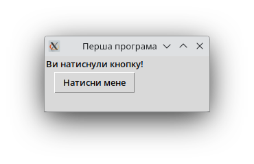
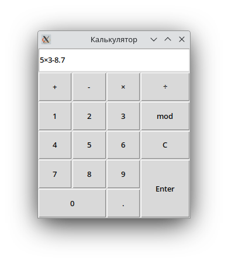

# Tkinter

У Java для створення _графічних інтерфейсів користувача_ ми використовували популярний _фреймворк_ JavaFX. Він був не єдиним у своєму роді, адже також для Java існували Swing, AWT, SWT та можливо інші бібліотеки. У Python є також декілька бібліотек для створення GUI, зокрема Kivy, wxPython, PyQT, однак вже вбудованим модулем є Tkinter.

Tcl — окрема динамічна високорівнева мова програмування, що у першу чергу створена для написання застосунків на власному GUI наборі інструментів Tk. Python вбудував часткову підмножину цієї мови та "огорнув" у свої класи під загальним модулем Tkinter, таким чином надаючи можливість розробникам використовувати Tk для простого створення базових графічних інтерфейсів. Tk є досить базовим, однак теж великим інструментом, тому у цьому розділі ми розглянемо лише основи основ.

_Віджетами_ називають загально усі компоненти, з яких складається GUI — це різні кнопки, текстові поля, слайдери, текстові мітки, прапорці тощо. Для підключення Tkinter можна імпортувати всі його компоненти для зручності: `from tkinter import *`.

## Текстова мітка

Для початку слід створити у програмі вікно, яке буде _коренем_ структири віджетів — найверхнім та початковим її компонентом: `root = Tk()`. Далі нехай додамо текстову мітку, батьком якої буде вікно `root`, а текст міститиме "Привіт світ": `label = Label(root, text = "Привіт світ!")`. Передостаннім важливим компонентом буде "запакувати" мітку у вікно функцією `label.pack()`: вона автоматично буде додана до вікна, яке у той самий час набуде розміру, достатнього для вміщення мітки.
Нарешті, що запустити програму, необхідно запустити _основний цикл_: `root.mainloop()`. Такий цикл виконуватиметься до закриття програми та створений для того, щоб оброблювати всі _події_, які можуть відбуватись у програмі, наприклад, натискання кнопки чи введення тексту.

```python
from tkinter import *

root = Tk()
label = Label(root, text = "Привіт світ!")
label.pack()

root.mainloop()
```

## Кнопки

Змінити розмір та назву вікна можна відповідно функціями: `root.title(<назва>)` та `root.geometry("<розмір_через_x>")`. Крім `pack()` також є ще один _менеджер геометрії_ `grid(column=<стопцець>, row=<рядок>)`, який розташовуватиме компоненти у вказаних клітинках (стовпець та рядок) вікна. Нехай додамо мітку вже відомим способом у клітинку (0, 0), а під нею (на 0, 1) створимо кнопку `Button()`, і нову функцію `on_clicked()`, яка буде виконуватись при натисканні кнопки:

```python
from tkinter import *

root = Tk()
root.title("Перша програма")
root.geometry("240x80")

lbl = Label(root, text="Натисни кнопку!")
lbl.grid(column=0, row=0)

def on_clicked():
    lbl.configure(text="Ви натиснули кнопку!")

btn = Button(root, text="Натисни мене", command=on_clicked)
btn.grid(column=0, row=1)

root.mainloop()
```
Прив'язування функції до дії кнопки відбувається тут одразу при її створенні через `command=<назва_функції>`. Метод `configure()` (або `config()`: вони аналогічні) дозволяє змінити властивості віджета — у даному випадку текст кнопки.



## Текстове поле

Пропоную додати до програми текстове поле між текстом та кнопкою, довжиною у 25 пікселів: `Entry(root, width=25)`. Текст із поля можна отримати функцією `get()`. Також змінімо колір тексту `fg` (від слова foreground — "передній план") на зелений, а колір тла `bg` (background — "задній план") на чорний.

```python
from tkinter import *

root = Tk()
root.title("Текст")
root.geometry("240x80")

lbl = Label(root, text="(тут може бути ваша реклама xD)")
lbl.grid(column=0, row=0)

txt = Entry(root, width=25)
txt.grid(column=0, row=1)

def on_clicked():
    lbl.configure(text = txt.get(),
                  fg = "green",
                  bg = "black")
btn = Button(root, text="Встановити текст", command=on_clicked)
btn.grid(column=0, row=2)

root.mainloop()
```

### Авторські права

Більшість матеріалу цього розділу до даної позначки є адаптацією (скороченим переказом) з англомовного джерела [GeeksForGeeks](https://www.geeksforgeeks.org/create-first-gui-application-using-python-tkinter/?ref=lbp). Решта розділів розроблені власноруч на власних знаннях, досвіді та шкільному матеріалі. Приклад калькулятора нижче теж оригінальний.

## Базовий калькулятор



```python
from tkinter import *

root = Tk()
root.title("Калькулятор")

txtfield = Entry(root)
txtfield.grid(column=0, row=0, columnspan=4, sticky="nwse")

def evaluate():
    txt = txtfield.get().replace('×', '*').replace('÷', '/').replace(' mod ', '%')
    txtfield.delete(0, END)
    try:
        txtfield.insert(0, eval(txt))
    except:
        txtfield.insert(0, "Error")

for col, op in enumerate(['+', '-', '×', '÷']):
    Button(root, text=op, command = lambda op=op: txtfield.insert(END, op))\
        .grid(column=col, row=1, sticky="nwse")
Button(root, text='mod', command = lambda: txtfield.insert(END, ' mod '))\
    .grid(column=3, row=2, sticky="nwse")

numbers = [
    ['1', '2', '3'],
    ['4', '5', '6'],
    ['7', '8', '9']
]
for row in range(2, 5):
    for col, num in enumerate(numbers[row-2]):
        Button(root, text=num, command = lambda num=num: txtfield.insert(END, num))\
            .grid(column=col, row=row, sticky="nwse")
Button(root, text='0', command = lambda: txtfield.insert(END, '0'))\
    .grid(column=0, row=5, columnspan=2, sticky="nwse")

Button(root, text='.', command = lambda: txtfield.insert(END, '.'))\
    .grid(column=2, row=5, sticky="nwse")
Button(root, text='C', command = lambda: txtfield.delete(0, END))\
    .grid(column=3, row=3, sticky="nwse")
Button(root, text='Enter', command = evaluate)\
    .grid(column=3, row=4, rowspan=2, sticky="nwse")

for col in range(4): root.columnconfigure(index=col, weight=1)
for row in range(6): root.rowconfigure(index=row, weight=1)

root.mainloop()
```
Розберімо приклад. `columnspan` та `rowspan` у `grid()` дозволяють вказати, скільки стовпців та рядків займає віджет (наприклад, `columnspan=4` вказує, що текстове поле у 4 стовпці). `sticky` зазначає, у які напрямки (n — north — північ, тощо) слід розтягувати віджет при розтяганні вікна; "nwse" — всі напрямки.

`Entry.delete(<початок>, <кінець>)` видаляє із текстового поля символи у проміжку індексів. `END` — вказує кінець поля. Таким чином `txtfield.delete(0, END)` видаляє всі символи, або очищає поле. `Entry.insert(<індекс>, <текст>)` вставляє текст за індексом.

`eval(<код>)` — особлива функція, що дозволяє виконувати вирази на Python у коді; тут вона використовується для обчислення числових виразів. _Це небезпечна функція_, адже може виконувати будь-який введений код, зокрема викликати функції. Для прикладу вона використана задля простоти програми, однак у справжніх проєктах уникайте її. `enumerate(<послідовність>)` зручна для використання у циклах, щоб мати одночасно індекс та значення за ним: `for <індекс>, <значення> in enumerate(<послідовність>)`. `\` + новий рядок надає можливість зробити так, наче перенесення на новий рядок немає, що дозволяє писати довгі вирази у кілька рядків.

Навіщо у лямбда-функціях параметр дорівнює самому собі? Через особливості присвоєння змінних у Пайтоні за співвикористанням, про які було кілька разів згадано, всі створені у циклі функції, що залежать від ітератора, посилались би на один і той самий об'єкт:

```python
a = []                  # Створимо список.
for i in range(5):      # Додамо в нього 4 лямбда-функції, що повертають `i`.
    a.append(lambda: i) # На момент створення кожної функції `i` різне.
for f in a:             # Однак, якщо викликати кожну лямбду,
    print(f())          # всі однаково повернуть число 4
```
Трюк, що ми вказуємо значення `i` на момент створення як значення для параметра лямбди за замовчуванням, копіює його і використовує за виклику без аргументів. `columnconfigure(index=<індекс>, weight=<вага>)` і `rowconfigure(index=<індекс>, weight=<вага>)` встановлюють для стопця і рядка відповідно "вагу" — коефіцієнт, з яким розтягуватиметься рядок чи стовпець порівняно з іншими. Якщо встановити для всіх рядків і стовпців однаковий коефіцієнт (наприклад, 1), то всі розтягуватимуться однаково.
