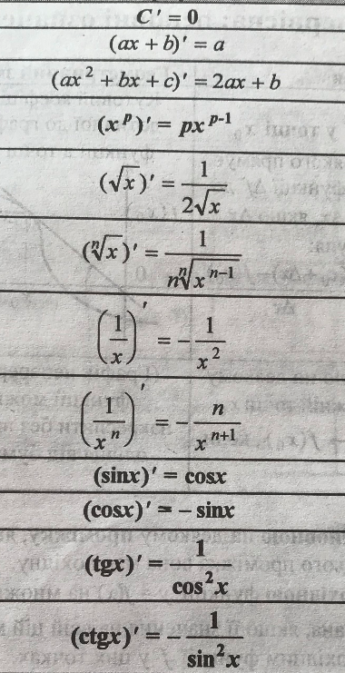
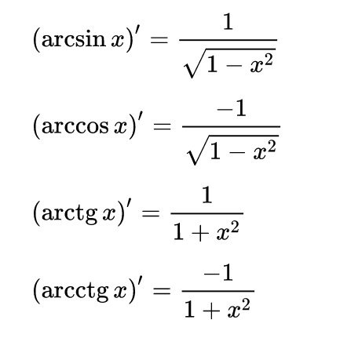
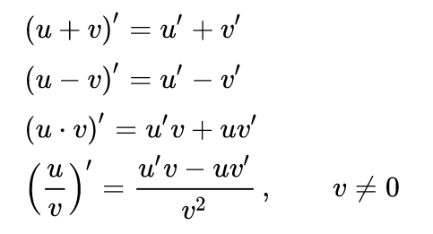
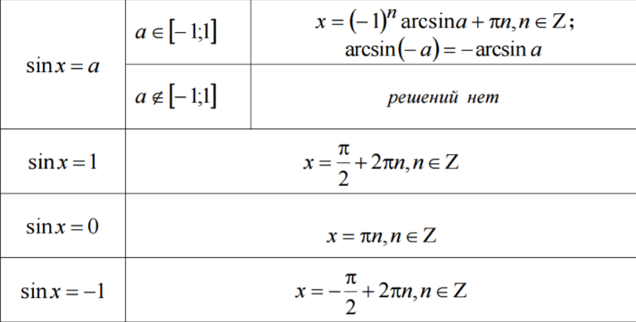
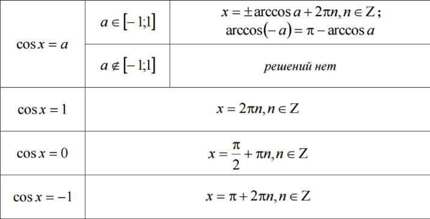
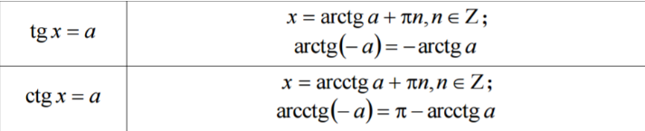
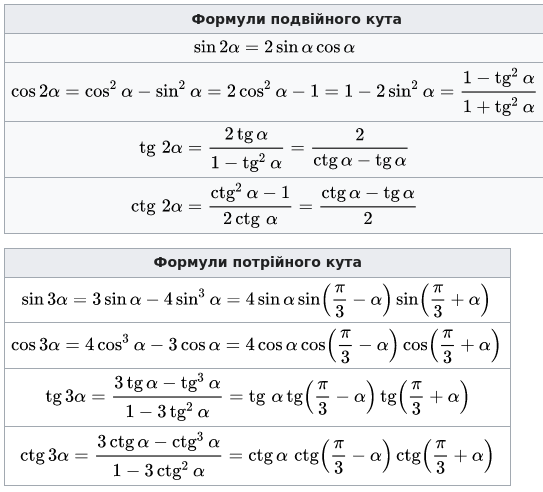
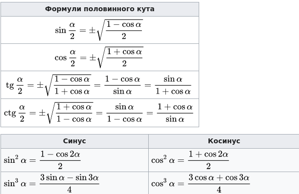
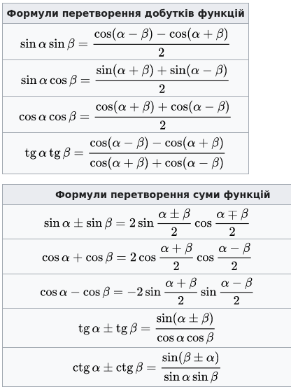

# Математика
{: .no_toc }

Содержание:
{: .no_toc .text-delta }

1. TOC
{:toc}

### Основні тригонометричні тотожності

- sin² α + cos² α = 1
- tg α × ctg α = 1
- tg² α + 1 = 1 / cos² α
- ctg² α + 1 = 1 / sin² α

### Тригонометричні перетворення (симетрія та зсув)

| α = 0            | α = π/2              | α = π             |
|:-----------------|:---------------------|:------------------|
| sin(-α) = -sin α | sin(π/2 - α) = cos α | sin(π-α) = sin α  |
| cos(-α) = cos α  | cos(π/2 - α) = sin α | cos(π-α) = -cos α |
| tg(-α) = -tg α   | tg(π/2 - α) = ctg α  | tg(π-α) = -tg α   |
| ctg(-α) = -ctg α | ctg(π/2 - α) = tg α  | ctg(π-α) = -ctg α |

| + π/2            | + π              | + 2π             |
|:-----------------|:---------------------|:------------------|
| sin(α + π/2) = cos α | sin(α+π) = -sin α | sin(α+2π) = sin α  |
| cos(α + π/2) = -sin α  | cos(α+π) = -cos α | cos(α+2π) = cos α |
| tg(α + π/2) = -ctg α   | tg(α+π) = tg α  | tg(α+2π) = tg α   |
| ctg(α + π/2) = -tg α | ctg(α+π) = ctg α  | ctg(α+2π) = ctg α |

### Обернені тригонометричні функції

| f(arcf x) = x     | arcf(f x) = x     |
|:------------------|:------------------|
| sin(arcsin x) = x | arcsin(sin x) = x |
| cos(arccos x) = x | arccos(cos x) = x |
| tg(arctg x) = x   | arctg(tg x) = x   |
| ctg(arcctg x) = x | arcctg(ctg x) = x |

### Таблиця тригонометричних функцій (0°–360°)

### Похідні основних функцій

### Корені тригонометричних функцій

### "Великі формули" (~50)

