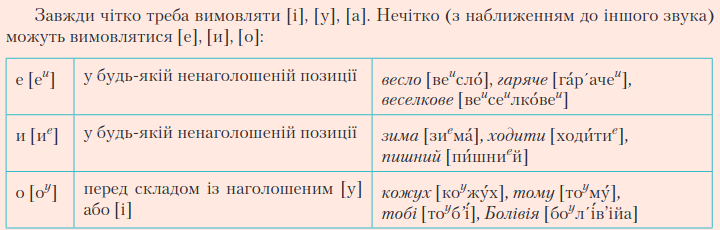
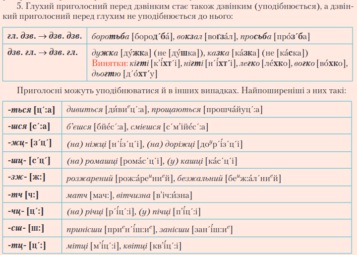
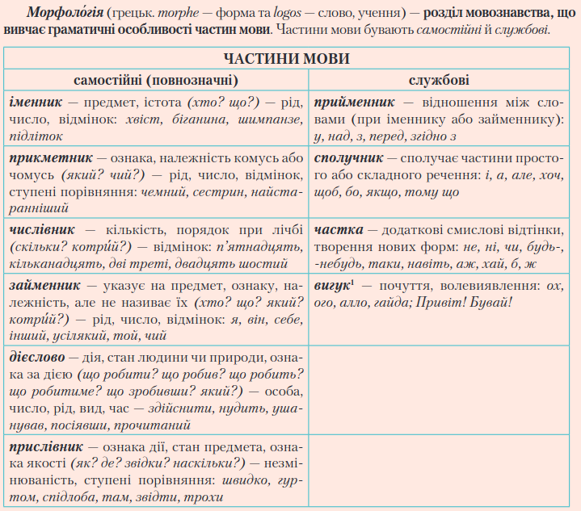

# Українська мова та література
{: .no_toc }

Зміст:
{: .no_toc .text-delta }

1. TOC
{:toc}

## Мова

#### Мовна норма

Помилки (подвійний наголос) поділяють на:

- Орфоепічні (вимова)
- Лексичні (значення слів)
- Фразеологічні (невдалі вислови)
- Граматичні (вживання слів)
- Орфографічні (правопис)
- Пунктуаційні (розділові знаки)
- Стилістичні (стилі мовлення)

#### Синоніми, антоніми, пароніми

- Синоніми (грецьк. synonymos — однойменний) — близькі за значенням слова.
- Антоніми (грецьк. anty — проти й onyma — ім’я) — протилежні за значенням слова.
- Пароніми (пари слів) — близькі за звучанням слова.

### Есе (кожен урок російської мови)

> Есе (фр. еssai — спроба, нарис) — прозовий твір, у якому автор висловлює свої міркування з приводу суперечливого, неоднозначного питання щодо проблеми, не претендуючи на ви-черпне висвітлення теми.

- Будова: вступ — основна частина — висновок.
- Стиль мовлення: публіцистичний або художній.
- Види есе: вільне та формальне есе.

### Вимова та звуки

### Наголос (найчастіші помилки)

Ва́ги, вантажі́вка, ви́падок, визво́ль­ний, відвезти́, ві́рші, вітчи́м, гуртожито́к, да́но, добу́ток, дові́дник, до́нька, дочка́, дро́ва, жалюзі́, завда́ння, за́гадка, закінчи́ти, заробі́ток, зру́чний, зубо́жіння, інду́стрія, йогу́рт, катало́г, кварта́л, ки́шка, кіломе́тр, ко́лія, ко́сий, котри́й, кро́їти, куліна́рія, ку́рятина, лис­топа́д, ма́ркетинг, мере́жа, металу́ргія, навча́ння, на́чинка, не́навидіти, нови́й, обіця́нка, обра́ння, обру́ч, одноразо́вий, о́лень, озна́ка, ота́ман, парте́р, піала́, пі́длітковий, пізна́ння, пітни́й, піце́рія, по́друга, полого́вий, поня́ття, порядко́вий, промі́жок, псевдоні́м, ра́зом, ре́шето, роздрі́бний, русло́, сере́дина, се́ча, симетрі́я, сільськогоспода́рський, спи́на, течія́, тризу́б, ту́луб, украї́нський, уподо́бання, усере́дині, фарту́х, фахови́й, фо́льга, фо́рзац, ца­́рина, це́нтнер, цінни́к, чарівни́й, чергови́й, чита́ння, чорно́зем, чорно́слив, ще́лепа.

[Візуальне сприйняття](https://ukr-mova.in.ua/library/nagolos/)

### Апостроф

| Треба писати (перед я, ю, є, ї)         | Але _не_ пишуть, якщо    |
|:----------------------------------------|:-------------------------|
| Після "**м**а**вп**и **б**у**ф**е**р**" | 2 приголосних            |
| Після префікса з приголосним в кінці    | закінчується на голосний |

Також апостроф пишуть в складних словах (наприклад, мін'юст, дит'ясла).

### Знак м'якшення (М'який знак)

Треба писати після "**д**е **т**и **з**'ї**с**и **ц**і **л**и**н**и"...

- У кінці слова
- У середині складу перед 'о'
- У суфіксах -ськ-, -цьк-, -зьк-, -ньк-, -оньк-, -еньк-, -есеньк-, -ісіньк-, -юсіньк-
- Перед -ся (у дієсловах)
- У сполуках "льч", "льц" (від "льк"), "ньч", "ньц" (від "ньк")
- Після 'л' перед м'яким приголосним
- Після 'л' перед шиплячим

**Винятки**: камінчик, промінчик, Уманщина, оболонський, бриньчати, няньчити, різьбяр, тьмяний, женьшень, Маньчжурія.

### Чергування звуків

- к, ц, ч + -ськ- → -цьк-
- г, з, ж + -ськ- → -зьк-
- х, с, ш + -ськ- → -ськ-

Також із суфіксом -ськ- пишемо: казахський, герцогський, баскський, меккський, цюрихський, тюркський.

- -ськ- + -ин- → -щ(ина)
- -зьк- + -ин- → -жч(ина)
- -цьк- + -ин- → -чч(ина)

### Спрощення

- здн → зн
- ждн → жн
- рдц → рц
- стл → ст
- стн → сн
- зкн → зн
- скн → сн
- слн → сн
- рнц → нц

**Винятки**: -стц-, -стч-, кістлявий, пестлявий, хвастливий, зап'ястний, хворостняк, шістнадцять, баластний, форпостний, аванпостний, компостний, -нтств-.

### Префікси

- с- пишуть перед "**к**а**ф**е '**Пт**а**х'"
- з- пишуть перед рештою

-ев(о) пишуть лише в словах "мар**ево**", "зар**ево**".

| пре- | при- | прі- |
|:----:|:----:|:----:|
| ~= дуже | ~= трошки | прірва, прізвище, прізвисько |

### Написання складних слів

- -сотий, -тисячний, -мільйонний пишуть _разом_
- авіа-, авто-, біо-, екстра-, псевдо-, лже-, моно- та схожі пишуть _разом_
- Якщо перша частина є числівником, пишуть _разом_
- напів-, полу- пишуть _разом_
- віце-, екс-, альфа-, міні-, контр-, поп-, веб- та схожі пишуть _разом_
- мало-, ново-, давньо- та схожі пишуть _разом_

- два непов'язаних слова (якщо маємо на увазі "і") пишуть _через дефіс_
- складені одиниці виміру пишуть _через дефіс_
- професії з чинами пишуть _через дефіс_
- поєднання або відтінки кольорів пишемо _через дефіс_
- проміжні частини світу пишемо _через дефіс_
- військово-, воєнно- пишемо _через дефіс_

"пів" пишуть _окремо_

Запам'ятайте правопис слів **(винятки)**: військовополонений, військовозобов'язаний, суспільно важливий, суспільно корисний, суспільно необхідний, усесвітньо історичний, півострів, півоберт, жовтогарячий, червоногарячий, золотогарячий.

[Більш детальне правило](http://nkkep.com/wp-content/uploads/2019/12/Pravopy-s-skladny-h-sliv.pdf)

### Іншомовні слова (апостроф та знак м'якшення)

> М'який знак → після "**д**е **т**и **з**'ї**с**и **ц**і **л**и**н**и" | 
> Апостроф → після "**м**а**вп**о**чк**а **Б**у**ф** **гр**ає **в** **ч**у**ж**і **ш**а**х**и"

### Частини мови

### Рід іменника

**Треба запам'ятати рід таких іменників:**

| Чоловічий | Жіночий |
|:---------:|:-------:|
|Біль, дріб, живопис, кір, насип,|Антресоль, бандероль, бешамель, бязь, вермішель,|
|нежить, перекис, пил, продаж, Сибір,|гуаш, жовч, заполоч, каніфоль, мігрень,|
|сип, собака, степ, степінь, ступінь,|нехворощ, обитель, папороть, путь, ретуш,|
|толь, тюль, фенхель, шампунь, ярмарок|розкіш, суміш, фланель, шагрень|

_Спільний рід:_ базіка, жаднюга, заїка, замазура, зівака, нездара, ненажера, нероба, підлиза, потвора, приблуда, причепа, рева, стиляга, трудяга; базікало, ледащо, сонько, чванько.

- **Жіночого роду є** назви риб, мов; _"цеце", "авеню", "боржомі", "броколі", "салямі"_.
- **Чоловічого роду є** професії, вітри, _тварини_.
- **Середнього роду є** неістоти.

### Закінчення родового відмінку (-у (-ю) / -а (-я))

| -а / -я | -у / -ю |
|:-------:|:-------:|
|Істоти, предмети|Абстрактні поняття, явища, дії|
|Імена, прізвища|Збірні поняття|
|Міри, одиниці виміру|Матеріали та речовини|
|Населені пункти|Країни, місця, будівлі, заклади|
|Географ. об'єкти з наг. на -закінченні|-основі|
|Більшість термінів,|окрім фіз., хім., літ. понять|

### Кличний відмінок

**Чоловічий рід**

|Закінчення|Якщо?|
|:--------:|:---:|
|-е|Тверда група, -р / -ж в мішаній|
|-у|-ик-, -ок-, -к(о), іншомовні імена, інші в мішаній|
|-ю|-ець/-єць, м'яка група|
|-о|-а в називному|

**Жіночий рід**

|Закінчення|Якщо?|
|:--------:|:---:|
|-о|Тверда група|
|-е/-є|М'яка, мішана, нульове закінчення|
|-ю|Пестливі слова м'якої групи|

### Імена по батькові

Творяться за допомогою -(й)ович, -івна/-ївна.

**Треба запам'ятати:** Григорович, Григорівна; Якович, Яківна; Ілліч, Іллівна; Хом(ов)ич, Лук(ов)ич, Сав(ов)ич, Кузьм(ов)ич, Миколович/Миколайович.

## Література

| Дата | Подія |
|:----:|:-----:|
|946|помста княгині Ольги древлянам|
|1113|Нестор Літописець - "Повіть минулих літ"|
|1185|невдалий похід князя Ігоря на половців|
|1663|Чорна рада у Ніжині|
|1798|Нова українська література ("Енеїда")|
|1814|народження Тараса Шевченка|
|1838|викуп Т. Шевченка з кріпацтва|
|1840|видання "Кобзаря"|
|1861|смерть Т. Шевченка|

- "Енеїда" (І. Котляревський) - перший твір _нової української літератури_
- "Наталка Полтавка" (І. Котляревський) - перший _драматичний_ твір НУЛ
- "Маруся" (Г. Квітка-Основ'яненко) - перший _прозовий_ твір НУЛ
- "Чорна рада" (П. Куліш) - перший _історичний_ роман

